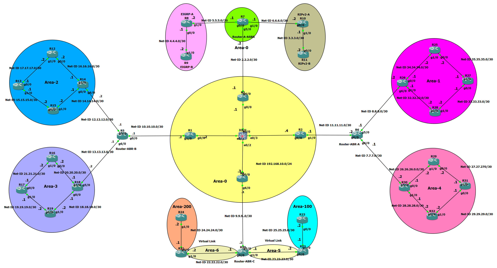

# Enterprise Multi-Protocol Routing Architecture Lab (32-Router Topology)



## 📌 Project Overview
This project is a high-level network simulation designed to showcase advanced routing logic, protocol interoperability, and hierarchical network design. The lab features a massive **32-router topology** integrated with multiple dynamic routing protocols, making it a perfect case study for Enterprise Core environments.

The primary goal is to demonstrate **Mutual Redistribution** between OSPF, EIGRP, and RIPv2, while solving connectivity issues in non-contiguous areas using **OSPF Virtual-Links**.

---

## 🛠 Technical Architecture

### 1. Hierarchical OSPF Design
- **Backbone (Area 0):** The core of the network (R1, R2, R3, R4) providing high-speed transit.  
- **Transit Areas (Area 5 & 6):** Intermediate areas used as logical paths for Virtual-Links.  
- **Remote/Isolated Areas (Area 100 & 200):** Branch sites connected back to the backbone via R21 and R22.  
- **Standard Branch Areas:** Area 1 and Area 4 providing connectivity to regional sites.  

### 2. Multi-Protocol Interoperability (ASBR)
The central **ASBR (R7)** manages the complex exchange of routing information between:
- **OSPFv2:** The main enterprise routing domain.  
- **EIGRP (AS 1):** Utilized for high-performance internal routing in specialized branches.  
- **RIPv2:** Integrated to support legacy or external site connectivity.  

### 3. Engineering Highlights
- **Mutual Redistribution:** Configured on R7 with specific metric seeding to ensure loop-free path selection.  
- **Traffic Engineering:** Strategic use of OSPF cost and EIGRP K-values to manipulate traffic flow.  
- **Virtual-Links:** Logical tunnels established through Area 5 and Area 6 to maintain OSPF hierarchy for remote segments.  

---

## 🔍 Verification & Testing

### OSPF Adjacency & Logical Links
```bash
# Check if all neighbors are in FULL state
show ip ospf neighbor

# Verify that Virtual-Links are up and the Adjacency is FULL
show ip ospf virtual-links
````

### Connectivity Test

* **End-to-End Reachability:** Successful ICMP pings between all loopback interfaces across different protocol domains.
* **Path Trace:** `traceroute` analysis confirms that traffic follows the deterministic paths defined by the routing logic.

---

## 📁 Repository Structure

* `/configs`: Contains the full `.cfg` running configurations for all 32 routers.
* `/topology`: Includes the GNS3/EVE-NG topology files for lab reproduction.
* `/documentation`: Detailed breakdown of the IP addressing scheme and OSPF Area mapping.

---

## 📄 License

This project is licensed under the MIT License - see the LICENSE file for details.

---

## 👨‍💻 Author

**Zain Al-abidine Al-jaradi**

Recent IT Graduate | Network Engineer

Specialized in Cisco Enterprise Routing & Switching

[GitHub Profile](https://github.com/ZainAliAljarardy/) | # [LinkedIn](https://www.linkedin.com/in/your-profile)
```
```
